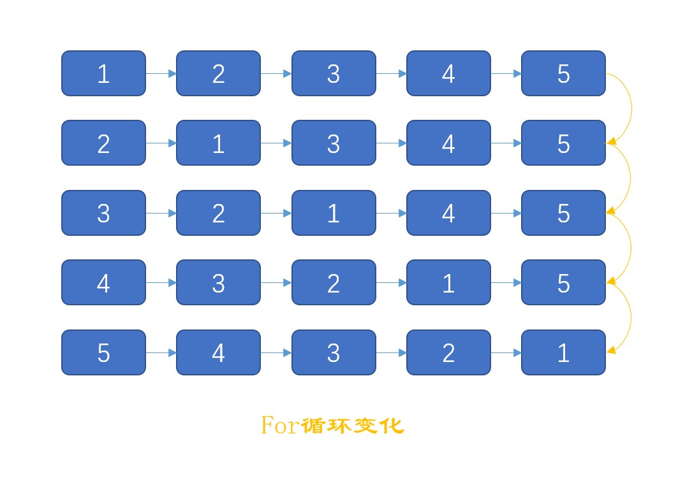
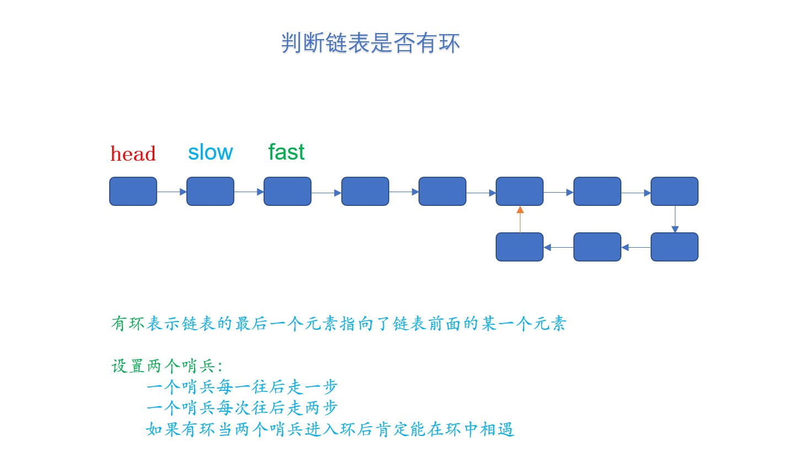
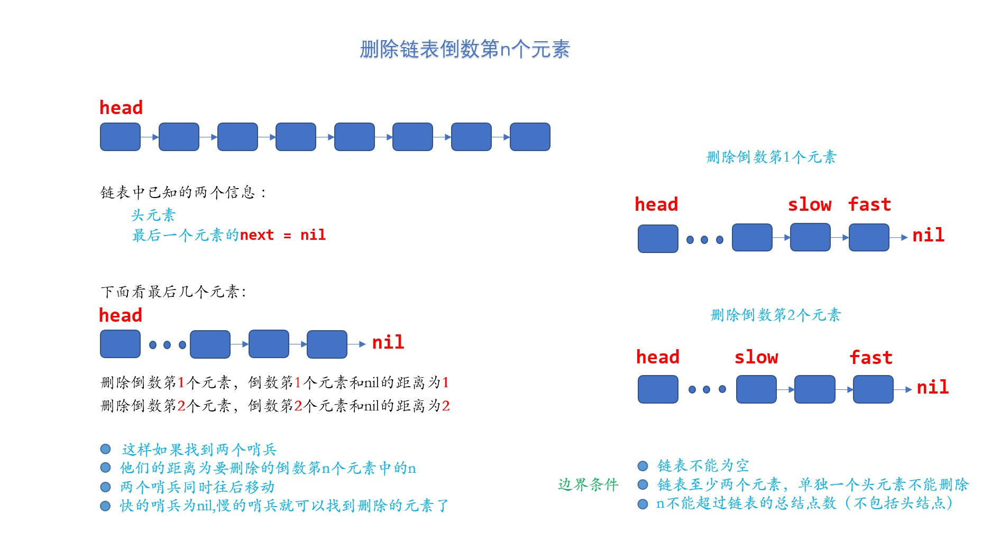
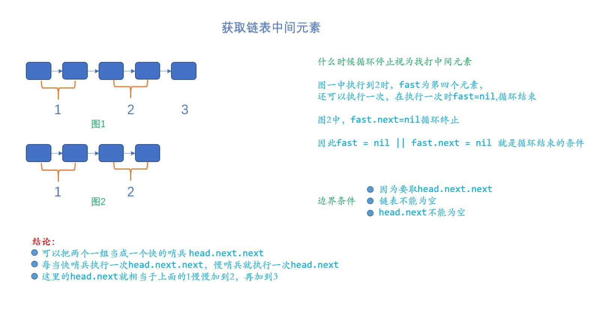

## 反转链表

反转链表的思路如下：

- 边界条件为链表为空或者链表只有一个元素。

- 如上图，每一次循环将一个元素移到最前面，第一次循环将2移到最前面，第二次循环将3移到最前面...

- 关键：每次将哪个元素移到最前面，每次循环链表的头部元素都在变化，需要保存，这样才能将新的元素指向当前链表的头部元素

`head`元素指向的就是每次需要移到链表头部的元素，`tmp`指向的就是当前链表的头元素
[反转链表代码](main.go)
##  判断链表是不是有环

主要注意几个边界问题

- 链表不能为空
- `fast`哨兵走的更快因为一直取`fast.next.next`,，所以`fast`以及`fast.next`不能为空
  [链表是否有环代码](main.go)

## 删除链表倒数第n个元素

[删除链表代码](main.go)

## 找到链表中间元素

[删除链表代码](main.go)
